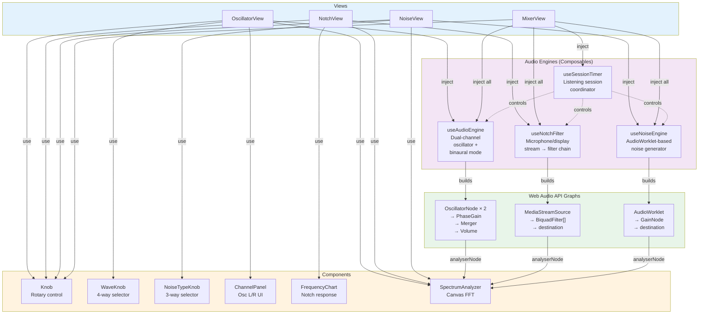

# Architecture: Noiserator

## Overview

Noiserator is a Vue 3 + TypeScript single-page audio tool with four pages (Oscillator, Notch Filter, Noise, Mixer) and a real-time spectrum analyzer. The architecture separates **audio engines** (composables) from **UI views** (Vue components), with state synchronized via reactive refs and localStorage persistence.

**Codebase metrics:**
- 28 files, 497 symbols, 11 core execution flows
- 4 pages + 1 master mixer + 1 full-page spectrum analyzer
- 3 independent audio engines + 1 coordination engine

---

## Functional Areas

### 1. **Composables** (31 symbols, 97% cohesion)

Audio engines that own `AudioContext` state and Web Audio API graphs. Each composable is independent and exposes reactive state + control methods.

| Composable | Purpose | Routing | LocalStorage Key |
|---|---|---|---|
| `useAudioEngine` | Dual-channel stereo oscillator with binaural mode | OscillatorView | `noiserator-settings` |
| `useNotchFilter` | Microphone/display stream → notch filter chain | NotchView | `noiserator-notch` |
| `useNoiseEngine` | White/pink/brown noise via AudioWorklet | NoiseView | `noiserator-noise` |
| `useSessionTimer` | Manages listening session duration; auto-stops all engines | MixerView | (none—state only) |

**Shared interface:**
- `analyserNode: Ref<AnalyserNode \| null>` — created on start, nulled on stop; tapped from output for spectrum analysis
- LocalStorage sync happens inside composables (components/views are unaware)

### 2. **Views** (4 pages)

Vue components that mount a single audio engine and provide UI controls.

| View | Composable | Controls | Spectrum |
|---|---|---|---|
| `OscillatorView` | `useAudioEngine` | Frequency, waveform, volume, phase per channel; binaural toggle | Yes |
| `NotchView` | `useNotchFilter` | Add/remove/toggle bands; per-band frequency, Q | Yes |
| `NoiseView` | `useNoiseEngine` | Noise type (white/pink/brown); stereo width | Yes |
| `MixerView` | All three + `useSessionTimer` | Start/stop toggles + volume knobs per engine; timer presets (30s–5m) + custom input | No |

**Tab routing:** Single `ref<'oscillator' \| 'notch' \| 'noise' \| 'mixer'>` in `App.vue`.

### 3. **Components** (10 symbols)

Reusable UI primitives with no audio dependencies.

| Component | Purpose |
|---|---|
| `Knob` | SVG rotary knob with drag, scroll, click-to-edit |
| `WaveKnob` | Knob snapped to 4 waveforms; click-to-cycle |
| `NoiseTypeKnob` | Knob snapped to 3 noise types |
| `ChannelPanel` | Composes Knob + WaveKnob + toggles for one oscillator channel |
| `FrequencyChart` | SVG notch filter response curve; purely visual (no audio nodes) |
| `SpectrumAnalyzer` | Canvas FFT display with `requestAnimationFrame` loop |

### 4. **Audio Engines** (Web Audio API subgraphs)

#### Oscillator Engine (`useAudioEngine`)
```
OscillatorNode (L)  ─┐
                      ├─ PhaseInversion (GainNode) ─┐
OscillatorNode (R)  ─┤                                ├─ ChannelMerger ─ Volume (GainNode) ─ destination
                      │                                │
                      └─ (no phase inversion)   ──────┘

Binaural mode: L = baseFreq, R = baseFreq + beatFreq (frequencies locked)
Phase inversion: GainNode.gain = 1 or −1
```

#### Notch Filter Engine (`useNotchFilter`)
```
getUserMedia() or getDisplayMedia()  ─ MediaStreamAudioSourceNode ─ BiquadFilterNode[] ─ destination
                                         (chain rebuilt on add/remove/toggle)
                                         (live freq/Q changes via setTargetAtTime)
```

#### Noise Engine (`useNoiseEngine`)
```
AudioWorkletNode (/noise-processor.js) ─ GainNode ─ destination
  (noise type: white/pink/brown via postMessage)
  (stereo width: AudioParam)
```

#### Session Timer (`useSessionTimer`)
```
Input: All three engines
Logic: setDuration(seconds) → countdown → auto-stop all engines when expired
State: duration, remainingTime, remainingFormatted, status ('idle' | 'running' | 'paused')
```

---

## Key Execution Flows

### 1. Notch Filter Activation: `OnKeydown → CreateChain` (5 steps, cross-community)
```
NotchView.onKeydown()
  → useNotchFilter.toggle()
    → useNotchFilter.start()
      → useNotchFilter.reconnect()
        → useNotchFilter.createChain()
```
**Purpose:** Toggle engine on → acquire stream → rebuild filter chain

### 2. Stream Acquisition: `OnKeydown → GetStream` (4 steps)
```
NotchView.onKeydown()
  → useNotchFilter.toggle()
    → useNotchFilter.start()
      → useNotchFilter.getStream()
```
**Purpose:** Request microphone or display media for processing

### 3. Oscillator Startup: `Toggle → BuildGraph` (3 steps)
```
OscillatorView.toggle()
  → useAudioEngine.start()
    → useAudioEngine.buildGraph()
```
**Purpose:** Initialize oscillator nodes and connections

### 4. Spectrum Visualization: `StartLoop → Draw` (3 steps)
```
SpectrumAnalyzer.startLoop()
  → SpectrumAnalyzer.loop() [requestAnimationFrame]
    → SpectrumAnalyzer.draw()
```
**Purpose:** Continuous FFT rendering at ~60 FPS

### 5. Notch Filter Chain Rebuild: `UseNotchFilter → CreateChain` (3 steps)
```
useNotchFilter setup
  → useNotchFilter.reconnect()
    → useNotchFilter.createChain()
```
**Purpose:** When bands are added/removed, rewire the filter chain

---

## Data Flow & State Management

### Reactive State Hierarchy

```
App.vue (currentTab: ref)
  ├─ OscillatorView
  │   └─ useAudioEngine() → analyserNode, frequency, waveform, volume, phase, ...
  │
  ├─ NotchView
  │   └─ useNotchFilter() → analyserNode, bands[], enabled, ...
  │
  ├─ NoiseView
  │   └─ useNoiseEngine() → analyserNode, noiseType, stereoWidth, ...
  │
  └─ MixerView
      ├─ useAudioEngine (injected)
      ├─ useNotchFilter (injected)
      ├─ useNoiseEngine (injected)
      └─ useSessionTimer(all three engines) → duration, remainingTime, status
```

### LocalStorage Persistence

- **OscillatorView:** `noiserator-settings` (frequency, waveform, phase, volume per channel, binaural mode)
- **NotchView:** `noiserator-notch` (bands array with freq, Q, enabled flag)
- **NoiseView:** `noiserator-noise` (noise type, stereo width)
- **Mixer:** None (transient state)

Sync is **inside composables** via `watch()` → localStorage and vice versa on mount.

---

## Styling & Visual Design

### Global CSS Variables (`src/style.css`)

- **Oscillator L:** `#7c5cbf` (purple)
- **Oscillator R:** `#00b8d9` (cyan)
- **Notch Filter:** `#e066ff` (magenta)
- **Noise:** `#4ecdc4` (teal)

All components use **scoped styles**. No CSS framework.

---

## Architecture Diagram



---

## Conventions

1. **Audio Parameters:** All parameter changes use `setTargetAtTime(value, ctx.currentTime, 0.005–0.01)` to avoid click artifacts.

2. **State Synchronization:** State that drives audio is stored in `ref<ChannelState>` and synced via `watch()` observers.

3. **Lifecycle:** Audio nodes are created in `start()` and cleaned up in `stop()`. `analyserNode` is a branch tap, created on start and nulled on stop.

4. **LocalStorage:** Persistence is **internal to composables**. Views and components have zero awareness of storage.

5. **No external libraries:** Pure Web Audio API + Vue 3 Composition API. No Howler, Tone.js, or similar.

---

## Performance Notes

- **SpectrumAnalyzer:** Runs a `requestAnimationFrame` loop at ~60 FPS. Drawing is O(FFT size), typically 2048 samples.
- **Oscillator binaural:** Frequency updates are reactive; frequency locks (L + R) are enforced in the composable.
- **Notch filter chain rebuild:** Expensive (reconnects all nodes). Only triggered on band add/remove/toggle, not on live freq/Q changes.
- **Session timer:** Uses `setInterval` (1-second granularity) and calls `engine.stop()` for all three on expiry.

---

## Future Extensibility

- **Preset system:** SavedState interface keyed by time/name in IndexedDB.
- **Routing library:** Current single-ref approach scales to ~10 pages; beyond that, consider Vue Router.
- **Multi-engine ducking:** Send one engine to sidechain compress another (e.g., oscillator ducks under notch filter).
- **Recording:** Route output through `MediaRecorder` API for WAV/MP3 export.
